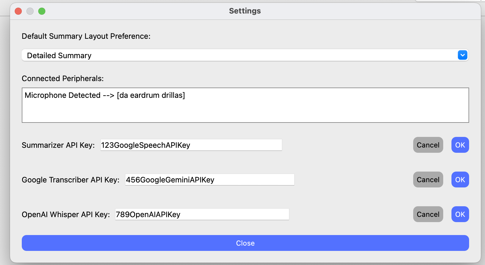

# Rheum AI
Rheum AI is a QT application that is designed to help rheumatologists and other healthcare professionals in summarizing
doctor-patient interaction. The program uses a combination of Open AI's Whisper model and Google's Speech API to transcribe a conversation. It then uses google's gemni 1.5 8b model to summarize the conversation. The program is designed to be used in a clinical setting, and it is intended to help healthcare professionals save time and improve patient care.

## Features
- Cross platform compatibility (Windows, macOS, Linux)
- Transcription of doctor-patient interaction
- Summarization of doctor-patient interaction
- Easy to use interface
- Fast and efficient
- Open source
- Built with QT and C++
- Uses Open AI's Whisper model and Google's Speech API for transcription
- Uses Google's Gemini 1.5 8b model for summarization

## Preview


<hr></hr>



## Code Documentation
All classes and methods are documented using Doxygen-style comments.

To generate HTML documentation:

```
doxygen Doxyfile
```
This will create a `docs` folder with the generated documentation.

## License
This project is licensed under the Apache License 2.0.

## Folder Structure
The project contains the following folder structure:

```
deployment/
    linux/                  # Linux build with executable and dependencies
        rheumai
    mac/                    # macOS build with .app bundle
        RheumAI.app         # macOS application
        run.sh              # Shell script to run the application (NEED TO USE THIS TO PROPERLY RUN THE APP)
    windows/                # Windows build with .exe and DLL dependencies
        rheumai.exe         # Executable for Windows
qt-app/
    main.cpp                # Main source file
    ... (other source files)
doc/
    html/                  # Doxygen generated documentation
    latex/                 # Doxygen generated LaTeX documentation
README                     # This file
```

## API Keys
- Google Speech API: You will need to set up your own Google Cloud account and enable the Speech-to-Text API. Follow the instructions [here](https://cloud.google.com/speech-to-text/docs/reference/rest/?apix=true) to get your API key.
- OpenAI Whisper: You will need to set up your own OpenAI account and get your API key. Follow the instructions [here](https://platform.openai.com/docs/api-reference/introduction) to get your API key. This is a **paid service so we will not** be providing the API key in the repository.
- Google Gemini: You will need to set up your own Google account and get your API key. Follow the instructions [here](https://console.cloud.google.com/apis/library/generativelanguage.googleapis.com?invt=AbtcGQ&project=gen-lang-client-0999730694) to get your API key.

### Why Do We Use 2 Transcription APIs?
The Google Speech transcription API comes with a free trial. We use that to test our product without racking up charges. 
The OpenAI Whisper API is a paid service so using it would incur costs. We still needed to use it however, since Google Speech 
requires **2 channels** to be recorded in order to transcribe the audio, and recordings must be under **60 seconds**. The OpenAI Whisper API does not require this, so it is used as a fallback in case the Google Speech API fails to transcribe the audio.

## Provided API Keys
Check the submitted PDF file for our project. We will give the API keys for Google Speech and Google Gemini. The API key for OpenAI Whisper is a paid service and we will not be providing it.

## Example Transcription for Testing
```
"Good morning, Mr. Taylor! It’s nice to meet you—how are you doing today?"
"Morning, Dr. Lee. I'm doing okay, a bit stiff this morning, but I made it in."
"Glad you did. Mondays can be a bit rough on all of us, huh? Especially when you wake up to chilly weather like this. Now, I’ve read through your referral, your primary mentioned joint pain, particularly in the mornings. Can you tell me more about that?"
"Yeah, it’s mainly in my hands and knees. The mornings are the worst—feels like I’m wearing concrete gloves. It takes at least 30 minutes before I can move properly."
"That definitely sounds discomforting. Any swelling or redness in those joints?"
"My fingers get puffy sometimes, but not really red."
"Got it. Any family history of arthritis or autoimmune conditions?"
"My mom has lupus, and my sister was recently diagnosed with rheumatoid arthritis."
"Thanks for sharing that. That family history does raise my index of suspicion. Let’s do a quick physical exam. I’m going to check your joints, let me know if anything feels tender."
"I’m noticing some mild swelling in your MCP joints and slight warmth around your knees. Any pain with this pressure?"
"Yeah, a bit—mostly in the fingers."
"Okay. Based on this exam and your history, I’m considering an early inflammatory arthritis like rheumatoid arthritis. We’ll run some blood tests—CBC, ESR, CRP, rheumatoid factor, and anti-CCP antibodies. I’ll also order X-rays of your hands and knees."
"Sounds good. Is this something that can be managed?"
"Absolutely. If we catch it early, treatment is very effective. We’ll meet again in about two weeks once your test results are back. In the meantime, gentle stretching in the morning and maybe using a warm compress can help ease the stiffness."
"Thanks, Dr. Lee. I appreciate that."
"No problem, Mr. Taylor. And if you’re a coffee drinker, now’s a good time to warm up those hands with a nice cup. Take care—I’ll see you soon."
"You bet. Thanks again."
```

## How to Run the Application

### Windows
1. Navigate to the windows/ folder.
2. Double-click on rheumai.exe to launch the application.
   - Ensure the dlls/ folder is in the same directory as rheumai.exe, as it contains required dependencies.

### macOS
1. Navigate to the mac/ folder.
2. Double-click on RheumAI.app to launch the application.
3. If you encounter a security warning about the app being from an unverified developer:
   - Open System Preferences > Security & Privacy.
   - Click Open Anyway to allow the app to run.

### Linux
1. Navigate to the linux/deployment/ folder.
2. Run the provided shell script:
   ```bash
   ./run.sh
   ```
   - This script sets up the required library paths and launches the application.
3. Make sure your system has a working display (X11 or Wayland) for the GUI.
4. Note: If Linux fails to run, you will have to open the project in QT creator, as shown below.

## How to Open the Project in Qt Creator
For those who wish to explore or modify the project, you can open the source code directly in Qt Creator.
### Steps to Open in Qt Creator
1. Install Qt Creator from https://www.qt.io/download.
2. Open Qt Creator and select File > Open File or Project.
3. Navigate to the qt-app/ folder and select the rheumai.pro file.
4. Select the appropriate build kit for your platform (e.g., MinGW for Windows, Clang for macOS, GCC for Linux).
5. Build and run the project directly from Qt Creator.

## Notes
- Cross-Platform Compatibility: This project has been tested on Windows and macOS ONLY. If you encounter any issues, please ensure the correct dependencies are present as described in the instructions above.
- Linux Display Requirement: The Linux build requires an active X11 or Wayland display to run the GUI.
- Dependencies: On Windows and Linux, the application depends on dynamic libraries (DLLs or .so files) that are included in the respective folders.

## Troubleshooting
- "Missing DLL" Error on Windows:
  - Ensure the dlls/ folder is in the same directory as mines.exe.

- "Could not connect to display" on Linux:
  - Make sure you have an active display server (X11 or Wayland).
  - If running on a headless server, set up a virtual display using Xvfb.

- macOS Security Warning:
  - See instructions under the macOS section above to allow the app to run.

## Acknowledgements
- OpenAI for the Whisper model.
- Google for the Speech-to-Text API and Gemini 1.5 8b model.
- Qt for the development framework.
- Team 1 for a totally awesome app.

## Contact
- **Andres Pedreros Castro** for questions related to audio recording and transcription.
- **Callum Thompson** for questions related to LLMs and summarization.
- **Joelene Hales** for questions related to design patterns used and the UML diagram.
- **Kalundi Serumaga** for questions related to file management and the folder structure.
- **Thomas Llamzon** for questions related settings menu features and UX/UI design.
